# CLASS DIAGRAM — HỆ THỐNG QUẢN LÝ KHO CÔNG TY BK

```mermaid
classDiagram

    %% ===================== USER & CUSTOMER =====================
    class User {
        +int id
        +String full_name
        +String email
        +String phone
        +String password
        +Enum role: admin|customer
        +DateTime created_at
        +login() bool
        +logout() void
        +changePassword() void
    }

    class Customer {
        +int id
        +String full_name
        +String phone
        +String email
        +String address
        +String company
        +int order_count
        +Decimal total_spent
        +DateTime created_at
        +getOrderHistory() Order[]
    }

    %% ===================== PRODUCT =====================
    class Category {
        +int id
        +String name
        +DateTime created_at
    }

    class Product {
        +int id
        +String code
        +String name
        +int category_id
        +String description
        +String unit
        +Decimal price
        +bool is_visible
        +Decimal min_stock
        +DateTime created_at
        +isLowStock() bool
        +toggleVisible() void
    }

    class ProductImage {
        +int id
        +int product_id
        +String file_path
        +int sort_order
    }

    class Inventory {
        +int id
        +int product_id
        +Decimal quantity
        +DateTime updated_at
        +addStock(qty) void
        +deductStock(qty) void
    }

    %% ===================== WAREHOUSE =====================
    class Supplier {
        +int id
        +String code
        +String name
        +String contact_person
        +String phone
        +String email
        +String address
        +DateTime created_at
    }

    class WarehouseReceipt {
        +int id
        +String code
        +int supplier_id
        +int product_id
        +Decimal quantity
        +String unit
        +Decimal unit_price
        +Decimal total_price
        +Date receipt_date
        +String note
        +int created_by
        +DateTime created_at
        +calcTotal() Decimal
    }

    class WarehouseIssue {
        +int id
        +String code
        +int product_id
        +Decimal quantity
        +String unit
        +Decimal unit_price
        +Decimal total_price
        +String reason
        +Date issue_date
        +String note
        +int created_by
        +DateTime created_at
        +calcTotal() Decimal
    }

    class Stocktake {
        +int id
        +String code
        +String note
        +int created_by
        +DateTime created_at
        +DateTime confirmed_at
        +confirm() void
        +isConfirmed() bool
    }

    class StocktakeItem {
        +int id
        +int stocktake_id
        +int product_id
        +Decimal system_quantity
        +Decimal actual_quantity
        +Decimal difference
        +String reason
        +calcDiff() Decimal
    }

    %% ===================== ORDER =====================
    class Order {
        +int id
        +String code
        +int customer_id
        +String customer_name
        +String customer_phone
        +String shipping_address
        +Decimal shipping_fee
        +Decimal subtotal
        +Decimal vat_amount
        +Decimal total_amount
        +Enum payment_method: cash|transfer
        +Enum payment_status: unpaid|partial|paid
        +Enum order_status: pending|approved|shipping|completed|cancelled
        +String note
        +DateTime created_at
        +approve() void
        +cancel() void
        +printInvoice() void
        +calcTotal() Decimal
    }

    class OrderItem {
        +int id
        +int order_id
        +int product_id
        +String product_name
        +String unit
        +Decimal quantity
        +Decimal unit_price
        +Decimal total_price
        +calcTotal() Decimal
    }

    class OrderStatusLog {
        +int id
        +int order_id
        +String old_status
        +String new_status
        +int changed_by
        +DateTime changed_at
    }

    class CartItem {
        +int id
        +int user_id
        +int product_id
        +Decimal quantity
        +DateTime created_at
        +updateQty(qty) void
        +remove() void
    }

    %% ===================== FINANCE =====================
    class Payment {
        +int id
        +int order_id
        +Decimal amount
        +Enum method: cash|transfer
        +Date payment_date
        +int confirmed_by
        +String note
        +DateTime created_at
        +confirm() void
    }

    class Expense {
        +int id
        +Enum type: labor|shipping
        +Decimal amount
        +Date expense_date
        +String description
        +int created_by
        +DateTime created_at
    }

    %% ===================== RELATIONSHIPS =====================

    %% User
    User "1" --> "0..*" WarehouseReceipt : creates
    User "1" --> "0..*" WarehouseIssue   : creates
    User "1" --> "0..*" Stocktake        : creates
    User "1" --> "0..*" Payment          : confirms
    User "1" --> "0..*" Expense          : records
    User "1" --> "0..*" CartItem         : has
    User "1" --> "0..*" OrderStatusLog   : changes

    %% Customer & Order
    Customer "1" --> "0..*" Order : places
    Order    "1" *-- "1..*" OrderItem       : contains
    Order    "1" *-- "0..*" OrderStatusLog  : logs
    Order    "1" *-- "0..*" Payment         : receives

    %% Product
    Category "1" --> "0..*" Product       : classifies
    Product  "1" *-- "0..*" ProductImage  : has
    Product  "1" *-- "1"    Inventory     : tracks
    Product  "1" --> "0..*" OrderItem     : ordered in
    Product  "1" --> "0..*" WarehouseReceipt : received as
    Product  "1" --> "0..*" WarehouseIssue   : issued as
    Product  "1" --> "0..*" StocktakeItem    : checked in
    Product  "1" --> "0..*" CartItem         : added to

    %% Warehouse
    Supplier  "1" --> "0..*" WarehouseReceipt : supplies
    Stocktake "1" *-- "1..*" StocktakeItem    : contains

    %% Inventory update triggers
    WarehouseReceipt ..> Inventory : <<updates +qty>>
    WarehouseIssue   ..> Inventory : <<updates -qty>>
    Stocktake        ..> Inventory : <<adjusts qty>>
```

---

## Ghi chú quan hệ

| Ký hiệu | Ý nghĩa |
|---|---|
| `1 --> 0..*` | Một - nhiều (association) |
| `1 *-- 1..*` | Composition (phần tử con không tồn tại độc lập) |
| `..>` | Dependency (tác động gián tiếp) |

## Nhóm lớp

| Nhóm | Lớp |
|---|---|
| Người dùng | User, Customer |
| Sản phẩm | Category, Product, ProductImage, Inventory |
| Kho | Supplier, WarehouseReceipt, WarehouseIssue, Stocktake, StocktakeItem |
| Đơn hàng | Order, OrderItem, OrderStatusLog, CartItem |
| Tài chính | Payment, Expense |
