# USE CASE TỔNG QUÁT — HỆ THỐNG QUẢN LÝ KHO CÔNG TY BK

```mermaid
graph TD
    %% ===================== ACTORS =====================
    KH(["👤 Khách Hàng"])
    AD(["🔑 Quản Trị Viên\n(Admin)"])

    %% ===================== AUTH =====================
    subgraph AUTH ["🔐 Xác Thực"]
        UC1["Đăng ký tài khoản"]
        UC2["Đăng nhập"]
        UC3["Đăng xuất"]
    end

    %% ===================== CUSTOMER =====================
    subgraph CUSTOMER ["🛍️ Khách Hàng"]
        UC4["Xem danh sách sản phẩm"]
        UC5["Tìm kiếm sản phẩm"]
        UC6["Xem chi tiết sản phẩm"]
        UC7["Thêm vào giỏ hàng"]
        UC8["Đặt hàng"]
        UC9["Xem lịch sử đơn hàng"]
        UC10["Liên hệ / Giới thiệu"]
    end

    %% ===================== WAREHOUSE =====================
    subgraph WAREHOUSE ["🗃️ Quản Lý Kho"]
        UC11["Xem tồn kho"]
        UC12["Tạo phiếu nhập kho\n(+ OCR ảnh)"]
        UC13["Tạo phiếu xuất kho\n(+ OCR ảnh)"]
        UC14["Tạo phiếu kiểm kê"]
        UC15["Xác nhận kiểm kê\n→ cập nhật tồn kho"]
    end

    %% ===================== PRODUCTS =====================
    subgraph PRODUCTS ["📦 Quản Lý Sản Phẩm"]
        UC16["Quản lý danh mục"]
        UC17["Thêm / Sửa / Xóa sản phẩm"]
        UC18["Ẩn / Hiện sản phẩm"]
        UC19["Xem tồn kho sản phẩm"]
    end

    %% ===================== ORDERS =====================
    subgraph ORDERS ["🛒 Quản Lý Đơn Hàng"]
        UC20["Xem danh sách đơn hàng"]
        UC21["Import đơn hàng từ Excel"]
        UC22["Duyệt / Giao / Hoàn thành đơn"]
        UC23["Hủy đơn hàng"]
        UC24["In hóa đơn PDF"]
        UC25["Quản lý khách hàng\n(+ OCR / Excel)"]
    end

    %% ===================== FINANCE =====================
    subgraph FINANCE ["💰 Tài Chính"]
        UC26["Quản lý nhà cung cấp\n(+ OCR / Excel)"]
        UC27["Ghi nhận chi phí\n(nhân công / vận chuyển)"]
        UC28["Ghi nhận thanh toán đơn hàng"]
    end

    %% ===================== STOCK LEDGER =====================
    subgraph LEDGER ["📊 Sổ Kho"]
        UC29["Xem tổng hợp N-X-T theo tháng"]
        UC30["Import Excel tổng hợp N-X-T"]
        UC31["Tạo sản phẩm mới từ mã Excel"]
        UC32["Xem sổ chi tiết vật tư"]
        UC33["Xuất Excel báo cáo"]
    end

    %% ===================== REPORTS =====================
    subgraph REPORTS ["📈 Báo Cáo"]
        UC34["Báo cáo doanh thu"]
        UC35["Báo cáo tồn kho"]
        UC36["Dashboard tổng quan"]
    end

    %% ===================== RELATIONS — KHÁCH HÀNG =====================
    KH --> UC1
    KH --> UC2
    KH --> UC3
    KH --> UC4
    KH --> UC5
    KH --> UC6
    KH --> UC7
    KH --> UC8
    KH --> UC9
    KH --> UC10

    %% ===================== RELATIONS — ADMIN =====================
    AD --> UC2
    AD --> UC3

    AD --> UC11
    AD --> UC12
    AD --> UC13
    AD --> UC14
    AD --> UC15

    AD --> UC16
    AD --> UC17
    AD --> UC18
    AD --> UC19

    AD --> UC20
    AD --> UC21
    AD --> UC22
    AD --> UC23
    AD --> UC24
    AD --> UC25

    AD --> UC26
    AD --> UC27
    AD --> UC28

    AD --> UC29
    AD --> UC30
    AD --> UC31
    AD --> UC32
    AD --> UC33

    AD --> UC34
    AD --> UC35
    AD --> UC36

    %% ===================== INCLUDE / EXTEND =====================
    UC8 -.->|"<<include>>"| UC7
    UC12 -.->|"<<extend>>\nOCR Gemini AI"| UC12
    UC13 -.->|"<<extend>>\nOCR Gemini AI"| UC13
    UC25 -.->|"<<extend>>\nOCR / Excel"| UC25
    UC26 -.->|"<<extend>>\nOCR / Excel"| UC26
    UC30 -.->|"<<include>>"| UC31
    UC22 -.->|"<<include>>"| UC24
    UC15 -.->|"<<include>>"| UC19

    %% ===================== STYLE =====================
    classDef actor fill:#1565c0,stroke:#42a5f5,color:#fff,rx:50
    classDef uc fill:#1e1e1e,stroke:#555,color:#e0e0e0
    classDef ai fill:#4a148c,stroke:#9c27b0,color:#fff

    class KH,AD actor
    class UC12,UC13,UC25,UC26 ai
```

---

## Mô tả Actor

| Actor         | Mô tả                                                  |
|---------------|--------------------------------------------------------|
| Khách Hàng    | Người dùng cuối — xem sản phẩm, đặt hàng, theo dõi đơn |
| Quản Trị Viên | Nhân viên công ty — quản lý toàn bộ hệ thống           |

## Nhóm Use Case

| Nhóm        | Số UC | Ghi chú                             |
|-------------|-------|-------------------------------------|
| Xác thực    | 3     | Đăng ký, đăng nhập, đăng xuất       |
| Khách hàng  | 7     | Mua hàng, giỏ hàng, lịch sử         |
| Quản lý kho | 5     | Nhập/xuất/kiểm kê — có OCR AI       |
| Sản phẩm    | 4     | CRUD sản phẩm, danh mục             |
| Đơn hàng    | 6     | Duyệt đơn, in hóa đơn, import Excel |
| Tài chính   | 3     | NCC, chi phí, thanh toán            |
| Sổ kho      | 5     | N-X-T, sổ chi tiết, xuất Excel      |
| Báo cáo     | 3     | Dashboard, doanh thu, tồn kho       |

> UC có màu tím = tích hợp **Gemini AI OCR** (đọc ảnh tự động điền form)
